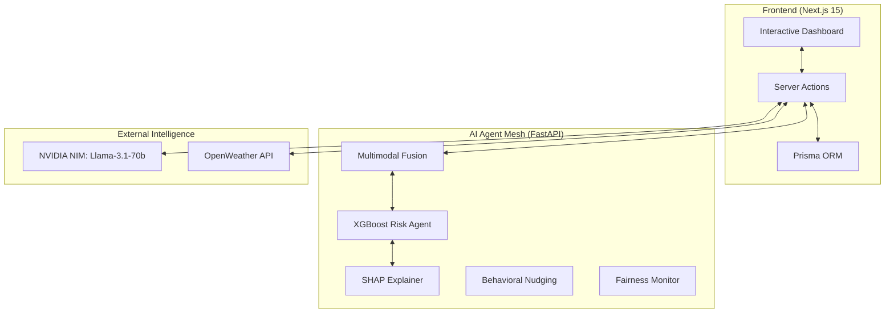

# AASMA: Adaptive Agent-based Smart Multimodal Assistant 🏥✨

[](https://opensource.org/licenses/MIT)
[](https://nextjs.org/)
[](https://fastapi.tiangolo.com/)
[](https://www.prisma.io/)
[](https://xgboost.readthedocs.io/)

**AASMA** is a state-of-the-art, full-stack multimodal AI healthcare platform designed for high-stakes clinical environments. It integrates real-time wearable telemetry, EHR history, and environmental hazards to provide clinicians with predictive, explainable, and actionable intelligence.

---

## 🌟 Key Pillars

### 1. Multimodal Intelligence Mesh
- **Fusion Engine**: Combines static EHR data (60% weight) with dynamic wearable signals (40% weight) for high-precision risk scoring.
- **SHAP Explainability**: Every prediction is accompanied by a feature attribution breakdown, ensuring clinicians understand the *why* behind the AI’s alert.
- **Hybrid Anomaly Detection**: Blends population-level Isolation Forest outliers with personalized patient-specific Z-score baselines.

### 2. Clinical Operations & Well-being
- **Burnout Detection**: Real-time staff monitoring based on shift duration, patient load, and sleep quality to prevent fatigue-related errors.
- **Drug Repositioning**: Llama-3.1 powered analysis identifying repositioning candidates and clinical contraindications in polypharmacy profiles.

### 3. Behavioral Science & Active Learning
- **Prospect Theory Nudging**: Leverages behavioral economics (Loss Aversion vs. Social Proof) to drive patient medication adherence based on real-time telemetry.
- **Active Learning Loop**: A dedicated clinician feedback interface that allows experts to "Verify" or "Flag" AI insights, iteratively refining the model’s accuracy.

---

## 🏗️ System Architecture



---

## 🛠️ Tech Stack

- **Frontend**: [Next.js](https://nextjs.org/), [Tailwind CSS](https://tailwindcss.com/), [Framer Motion](https://www.framer.com/motion/), [Shadcn/UI](https://ui.shadcn.com/)
- **Backend**: [Python](https://www.python.org/), [FastAPI](https://fastapi.tiangolo.com/), [Uvicorn](https://www.uvicorn.org/)
- **Machine Learning**: [XGBoost](https://xgboost.readthedocs.io/), [SHAP](https://shap.readthedocs.io/), [Scikit-Learn](https://scikit-learn.org/), [Fairlearn](https://fairlearn.org/)
- **Database**: [SQLite](https://www.sqlite.org/) via [Prisma](https://www.prisma.io/)
- **LLM**: NVIDIA NIM (Llama-3.1-70b, Qwen-2.5)

---

## 🚀 Installation & Setup

### 1. Clone the Repository
```bash
git clone https://github.com/W-govind/AASMA.git
cd AASMA
```

### 2. Environment Configuration
Create a `.env` file in the root directory:
```env
DATABASE_URL="file:./prisma/dev.db"
NEXTAUTH_SECRET="your-secret-key"
NEXTAUTH_URL="http://localhost:3000"
NV_API_KEY="your-nvidia-nim-api-key"
OPENWEATHER_API_KEY="your-openweathermap-key"
```

### 3. Frontend Setup
```bash
npm install
npx prisma generate
npx prisma db push
npm run dev
```

### 4. Backend Setup
```bash
cd backend
python -m venv venv
# Windows
.\venv\Scripts\activate
pip install -r requirements.txt
python api_server.py
```

---

## 🔬 Scientific Foundations

- **Prospect Theory**: Our Behavioral Nudging module applies the 2.5x psychological weight of loss framing to improve patient adherence.
- **Fairness Monitoring**: Real-time evaluation across protected attributes (Age, Gender) using Demographic Parity and Equalized Opportunity metrics.
- **Federated Learning**: Simulation of privacy-preserving model aggregation (FedAvg) across three secure hospital nodes.

---

## 📄 License
Distributed under the MIT License. See `LICENSE` for more information.

---

## 📬 Contact
**W-govind** - [GitHub Profile](https://github.com/W-govind)

Project Link: [https://github.com/W-govind/AASMA](https://github.com/W-govind/AASMA)
