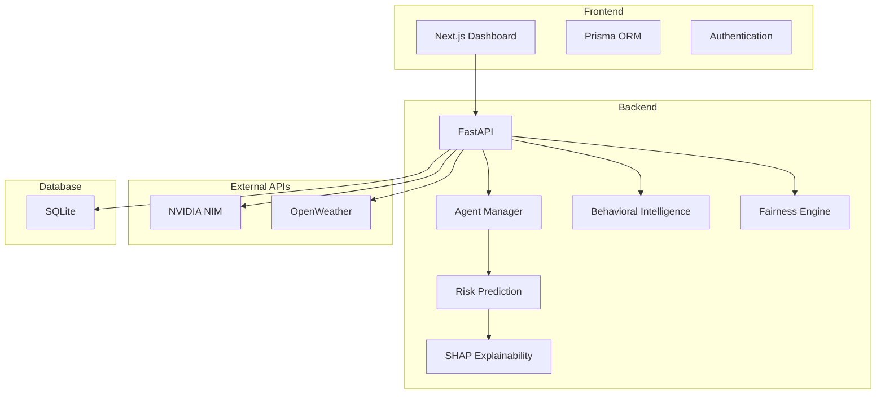

# 🏥 AASMA: Adaptive Agent-Based Smart Multimodal Assistant

<div align="center">

[](https://opensource.org/licenses/MIT)
[](https://nextjs.org/)
[](https://fastapi.tiangolo.com/)
[](https://www.prisma.io/)
[](https://xgboost.readthedocs.io/)
[](https://doi.org/10.21917/ijdsml.2026.0198)
[](https://doi.org/10.21917/ijdsml.2026.0198)

**A Peer-Reviewed AI-powered Multimodal Clinical Decision Support System for Proactive Healthcare**

</div>

---

# Overview

AASMA (**Adaptive Agent-Based Smart Multimodal Assistant**) is an intelligent healthcare platform that combines **Artificial Intelligence**, **Machine Learning**, **Explainable AI (XAI)**, **Agent-Based Systems**, and **Multimodal Data Fusion** to provide proactive patient monitoring and early clinical deterioration prediction.

The system integrates Electronic Health Records (EHR), wearable sensor data, environmental information, and clinician feedback to generate explainable, context-aware clinical insights for real-time healthcare decision support.

---

# 📄 Peer-Reviewed Publication

This project has been published in the **ICTACT Journal on Data Science and Machine Learning**.

### **Publication**

**AASMA: An Adaptive Agent-Based Smart Multimodal Assistant for Proactive Healthcare**

**Lead Author:** Govind Sharma

**Authors**

- Govind Sharma
- Shaurya Pal Singh
- Disha Basu
- B.V.A.N.S.S. Prabhakar Rao

**Journal**

ICTACT Journal on Data Science and Machine Learning

**Volume:** 7

**Issue:** 3

**Year:** 2026

**Pages:** 1077–1082

**DOI**

https://doi.org/10.21917/ijdsml.2026.0198

### Citation

```text
Sharma, G., Singh, S. P., Basu, D., & Rao, B. V. A. N. S. S.
(2026). AASMA: An Adaptive Agent-Based Smart Multimodal Assistant
for Proactive Healthcare.
ICTACT Journal on Data Science and Machine Learning,
7(3), 1077–1082.
https://doi.org/10.21917/ijdsml.2026.0198
```

If you use this project in your research, please cite the publication.

---

# Research Highlights

- Peer-reviewed Journal Publication
- Lead-authored AI Healthcare Research
- Multimodal AI Framework
- Explainable AI using SHAP
- Intelligent Agent-Based Architecture
- Clinical Decision Support
- Predictive Analytics
- Healthcare Risk Prediction
- Context-Aware Alert Prioritization
- Human-in-the-loop Learning

---

# Key Features

## Multimodal Intelligence

- Integration of Electronic Health Records
- Wearable Sensor Analytics
- Environmental Risk Assessment
- Dynamic Risk Prediction

---

## Explainable AI

- SHAP Explainability
- Feature Attribution
- Transparent Clinical Predictions
- Trustworthy AI

---

## Clinical Decision Support

- Early Deterioration Detection
- Personalized Patient Monitoring
- Intelligent Alert Prioritization
- Risk Stratification

---

## Behavioral Intelligence

- Prospect Theory-based Patient Nudging
- Medication Adherence Prediction
- Clinician Feedback Loop
- Active Learning

---

## Responsible AI

- Fairness Monitoring
- Bias Detection
- Demographic Parity
- Equal Opportunity Evaluation

---

# System Architecture


```mermaid
graph TD

subgraph Frontend

A[Next.js Dashboard]

B[Prisma ORM]

C[Authentication]

end

subgraph Backend

D[FastAPI]

E[Agent Manager]

F[Risk Prediction]

G[SHAP Explainability]

H[Behavioral Intelligence]

I[Fairness Engine]

end

subgraph External APIs

J[NVIDIA NIM]

K[OpenWeather]

end

subgraph Database

L[SQLite]

end

A --> D

D --> E

E --> F

F --> G

D --> H

D --> I

D --> J

D --> K

D --> L
```

---

# Technology Stack

## Frontend

- Next.js 15
- React
- Tailwind CSS
- ShadCN UI
- Framer Motion

## Backend

- Python
- FastAPI
- Uvicorn

## Artificial Intelligence

- XGBoost
- SHAP
- Scikit-learn
- Fairlearn
- Isolation Forest

## Database

- SQLite
- Prisma ORM

## Large Language Models

- NVIDIA NIM
- Llama 3.1
- Qwen 2.5

---

# Installation

## Clone Repository

```bash
git clone https://github.com/W-govind/AASMA.git

cd AASMA
```

---

## Environment Variables

Create

```
.env
```

```env
DATABASE_URL="file:./prisma/dev.db"

NEXTAUTH_SECRET="your-secret"

NEXTAUTH_URL="http://localhost:3000"

NV_API_KEY="your-key"

OPENWEATHER_API_KEY="your-key"
```

---

## Frontend

```bash
npm install

npx prisma generate

npx prisma db push

npm run dev
```

---

## Backend

```bash
cd backend

python -m venv venv

# Windows

.\venv\Scripts\activate

pip install -r requirements.txt

python api_server.py
```

---

# Scientific Foundations

- Explainable AI (SHAP)
- Multimodal Learning
- Predictive Analytics
- Prospect Theory
- Active Learning
- Agent-Based Systems
- Federated Learning
- Fair AI
- Clinical Decision Support Systems
- Healthcare Informatics

---

# Future Work

- Real Hospital Deployment
- Federated Clinical Training
- ICU Integration
- Edge AI
- Medical Image Analysis
- LLM-powered Clinical Reasoning
- Reinforcement Learning for Treatment Recommendation

---

# License

Distributed under the MIT License.

See **LICENSE** for details.

---

# Contact

## Lead Author

**Govind Sharma**

Computer Science & Engineering

Vellore Institute of Technology, Chennai

---

### GitHub

https://github.com/W-govind

### Project Repository

https://github.com/W-govind/AASMA

### DOI

https://doi.org/10.21917/ijdsml.2026.0198

### ORCID

https://orcid.org/0009-0009-6154-0004

### LinkedIn

https://www.linkedin.com/in/YOUR-LINKEDIN-USERNAME

---

## ⭐ Support

If you found this project useful:

⭐ Star the repository

🍴 Fork the repository

📄 Cite the publication

🤝 Contribute to future development
